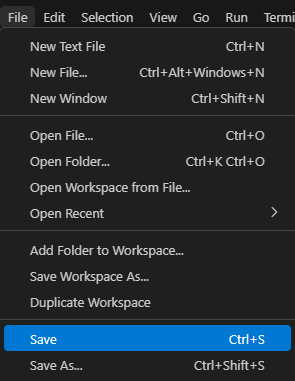
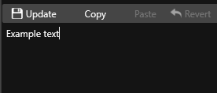

# Better Rivals Text mod for NFS Rivals
Created by [Zephyr](https://www.youtube.com/channel/UClBKsNkyF5kMl-6-Iv6QFtg), the Leader of Heated

## What does it change?
This mod **overhauls the game's text** in a rather entertaining way. It also **references** some of this game's **commonly known issues and problems**.

## How can I contribute to it?
You can **report spelling errors**, **suggest per-line changes** or **translate the mod to other languages**. (NOTE: the mod currently only works with the english language of the game)

## How can I report spelling errors?
To do that, create an [Issue](https://github.com/the-zphr/Better-Rivals-Text/issues) and provide required information.

## How can I suggest per-line changes/translate it?
Follow the guide below; there is also a [video](https://youtu.be/bO7HPa57f_E) that explains it visually: that link is a joke, but it explains how to use github

# Contributing

Prerequisites:
- Frosty Editor (or any software capable of editing .CSV files, such as [VS Code](https://code.visualstudio.com/download); Frosty Editor is highly recommended because you can launch the game directly with the mod injected and it makes editing easier)
- Frosty Mod Manager (optional; use it if you want to use your submission with other mods)
> [!NOTE]
> both can be found [here](https://github.com/CadeEvs/FrostyToolsuite/releases)

  
Step 1 (choosing)

Step 1: **Choose the way of contributing you'd like**. If it's **suggesting single line changes**, you need the "**(unmodded)**" file. If it's **translating**, then you'd want to download the **regular** file.

  
Step 2 (downloading)

Step 2: If you chose **per-line changes**, download the "**[version] (unmodded).csv**" **file** from the directory you want (for example [**BRT 0.3a1 (unmodded).csv**](0.3%20Alpha%20releases/0.3a1/BRT%200.3a1%20(unmodded).csv) from [**0.3 Alpha releases/0.3a1**](0.3%20Alpha%20releases/0.3a1)). However, if you chose **translating**, download the file *without* "**(unmodded)**" in the filename.

  
Step 3 (Frosty Editor)

  
Step 3 (for **FE**): **Open Frosty Editor** and **open LSE** (**View** > **Localized String Editor**).

Then, click "**Import String List**" and **select the downloaded file**.

- for per-line changes: From the dropdown menu on the left of the LSE window choose "Show only **modified** strings". Here you can start editing the list to your own liking. 
- for translating: From the dropdown menu on the left of the LSE window choose "Show only **unmodified** strings". Here you can start translating the already modified lines.

  
Step 4 (VS Code)

  
Step 4 (for **VS Code**): Open VS Code and open the **downloaded file**. From here you can easily find lines by using the Find and replace feature (**CTRL + F**, expand the popup). 

After you're done, remember to **save the changes made in the file (CTRL + S)** 

  
Step 5 (submitting)

Step 5 (submitting): If you're using FE: make sure the list shows only **modified** lines, then click **Export String List** and make sure to save it as a .CSV file. If you're using VS Code: simply save the file and you're done. Now, to actually submit it, create a [Pull Request](https://github.com/the-zphr/Better-Rivals-Text/pulls) and attach your modified .CSV file.

> [!IMPORTANT]
> - do NOT change HEX values of lines as it WILL break the affected lines (UNLESS you're swapping them)
> - when you're done with one of the 3rd step's parts, **make sure to save the changes (CTRL + S)** to your .fbproject file (if you want to use it as a mod later on)
> - after changing a line, click "Update" above the text input window. Otherwise your change won't be applied
> 
> - when submitting, put the version along with the language (if it applies) in the filename
